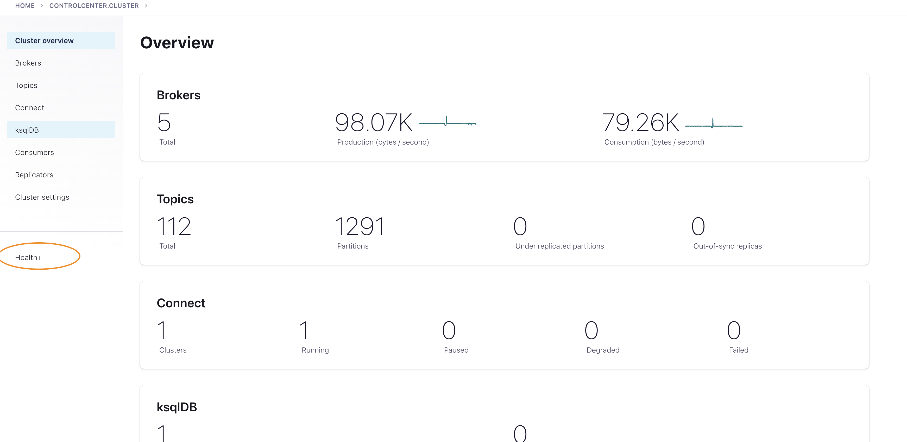
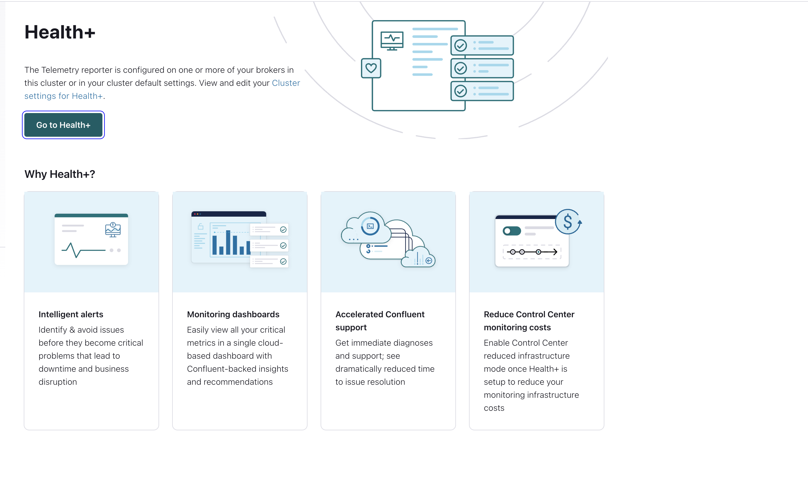
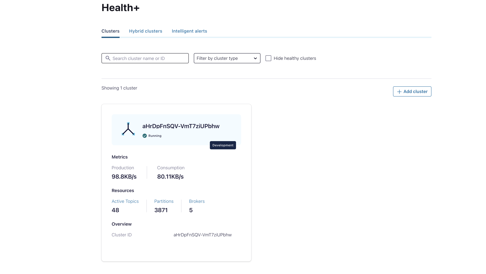
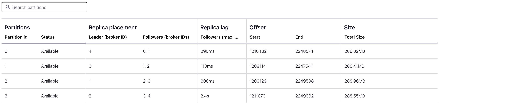
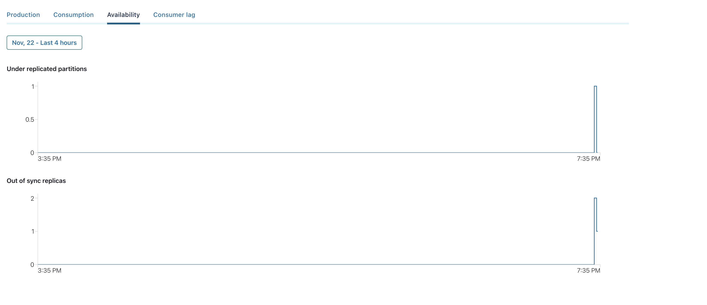
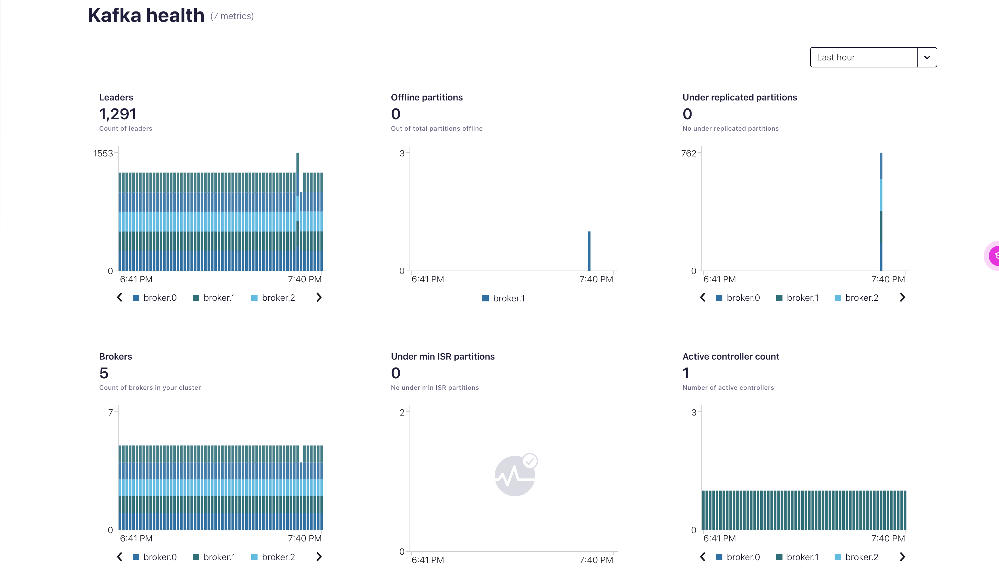

# Setting up Confluent Platform with Health+

Clone this directory in your local directory using the following commands:

    git clone https://github.com/mbhanpura/SBC-Demo.git

Change the working directory

    cd SBC-Demo

## Deploying EKS Cluster in AWS
Inorder to deploy an EKS cluster, one needs to simply run a ```terraform apply``` with the required paramters to deploy an EKS cluster in AWS.

In order to deploy the said EKS, run the following commands:
    
     
    cd terraform/
    terraform init

Run the following command to spin up the resources

    terraform apply \
    -var="region=<region_name>" \
    -var="name=<unique_prefix>" \
    -var="instance-type=<instance-type>"
- region: Its the region in which you want to deploy your EKS cluster
- name: unique identifier/prefix attached to your EKS cluster name and VPC created by terraform
- instance-type: The EC2 instance type to be used for your EKS cluster

**Note**: The above terraform command deploys a 3 node EKS cluster. Feel free to modify the node count as per your requirement.


### Configuring kubectl for deployment
Once the EKS has been deployed run the following command to configure the kubectl

    aws eks --region $(terraform output -raw region) update-kubeconfig \
    --name $(terraform output -raw cluster_name)


## Installing Customized CFK operator

Inorder to sync Health+ with your CFK deployment you need to deploy a customized CFK. To do that follow the below steps:

  1) Create the neccessary directory to store your CFK chart.
    
    cd ..

    kubectl create namespace confluent

    mkdir -p cfk-kubernetes-operator
 
  2) Pull the CFK Chart:

    
    helm repo add confluentinc https://packages.confluent.io/helm

    helm pull confluentinc/confluent-for-kubernetes \
    --untar \
    --untardir=cfk-kubernetes-operator \
    --namespace confluent
The values.yaml file is in the *cfk-kubernetes-operator* directory.
 
 1) Create a copy of the values.yaml file to customize CFK configuration. Do not edit the default values.yaml file. Save your copy to any file location; we will refer to this location as ```<path-to-values-file>```

        export PATH_TO_VALUES_FILE=<path-to-values-file>
   
  
        mkdir $PATH_TO_VALUES_FILE
       
    Copy the values.yaml file from "cfk-kubernetes-operator/confluent-for-kubernetes" in the above created directory
 2) Within this _values.yaml_ file, make the following changes:
   
        telemetry:
            operator:
                enabled: true  --- [1]
        enabled: true     -- [2]
    
    [1] Enable Telemetry Report for CFK.

    [2] Enable Telemetry Report for all Confluent Platform components.

1) Inorder to authenticate into Health+ within our Confluent Cloud Account, we need to pass a secret containing our Confluent Cloud API Key and API Secret. Inorder to do that,follow the below steps: 
   1) Create a file name _telemetry.txt_ in the **\<path-to-values-file\>** directory and store the necessary information in the following format:
           
           api.key=<cloud_key>
           api.secret=<cloud_secret>
   2) Create a secret using the following command:
   
          kubectl create secret generic -n confluent telemetry.txt --from-file=$PATH_TO_VALUES_FILE/telemetry.txt

2) Reference this secret within the _values.yaml_ file in the follwowing way:
   
        telemetry:
            secretRef: telemetry.txt

3) Once the _values.yaml_ file has been updated, install the CFK operator passing the custom _values.yaml_ file as reference.

       helm upgrade --install confluent-operator \
       confluentinc/confluent-for-kubernetes \
       --values $PATH_TO_VALUES_FILE\values.yaml \
       --namespace confluent

## Deploying Confluent Platform

Once the CFK operator has been installed, the next step is to deploy our Confluent Platform onto the provisioned EKS cluster.

Inorder to do that simply deploy/apply the cp-setup.yaml file stored in the ```kubernetes``` directory of this repo using the following command:

    kubectl apply -f ./kubernetes/cp-setup.yaml -n confluent

Before we move to the next steps, I want to discuss about the cp-setup.yaml. 
This YAML file has been modified to expose the Control Center pod through an ELB url. This is done so that we have a stable url to access the Control Center as part of the demo. Following is the code snippet showcase the changes made within the YAML file to achieve the same.

    apiVersion: platform.confluent.io/v1beta1
    kind: ControlCenter
    metadata:
        name: controlcenter
        namespace: confluent
    spec:
        externalAccess:
        type: loadBalancer
        loadBalancer:
            domain: <DOMAIN_NAME>

**Note**: For the local deployment of Confluent Platform, you can avoid creating hosted zones.

Check if your pods are in the ```RUNNING``` state using the following command.

    kubectl get pods

Once all the pods are in the ```RUNNING``` state, run the following command to get the required url to access Control Center.

    chmod +x /kubernetes/get-url.sh
    ./kubernetes/get-url.sh

Copy the output returned from the executing the above command and paste it in your local browser.

*Note*: It might take a few minutes for the url to return the Control Center UI. So have patience :) 

## Accessing Health+

Once the Confluent Control Center is accessible through the URL, you can access Health+ in the following way:

1) Click on the Health+ option from the left panel of the Control Centre UI
   <div align="center"> 
   
    </div> 
2) Click on **Go to Health+** on the following page to be routed to Confluent Cloud where your Health+ cluster is hosted.
   <div align="center"> 
   
    </div> 
3) Once you have authenticated into Confluent Cloud, you can access your Health+ cluster linked with your CP deployment.
    <div align="center"> 
   
    </div> 
## Self-Balancing Cluster

For the demoing the SBC feature we are going to run either of the two operations:

1) Deleting a Kafka Pod: Replicating a broker failure event.
2) Tainting a EKS Node : Replicating an AZ failure event.

Following are the two scripts to be used for the same:

- delete_broker.sh : Deleting a Kafka Pod 
- delete_node.sh : Tainting a EKS Node

Steps to execute the following script:

    chmod +x /sbc/delete_broker.sh
    chmod +x /sbc/delete_node.sh
    
    --If you want to delete a node run the following command
    ./sbc/delete_broker.sh -n <namespace>

    --If you want to taint a node run the following command
    ./sbc/delete_node.sh -n <namespace>


## Observability through Confluent Control Center and Health+

Inorder to visualize the effects of deleting a broker/node from your Confluent Platform setup, you can leverage the following methods:

1) Showcase the partitioning strategy of a pre-existing topic. In an event of a broker failure,SBC automatically reshuffles the partitions across the available brokers.

    <div align="center"> 
   
    </div> 

2) Showcase the **Availability** metrics for each topic to highlight the autonomous and self-healing nature of SBC.
   <div align="center"> 
   
    </div> 

3) Go to Health+ to showcase an indepth of analysis of broker health and topic health across the failure event that you triggered.
   <div align="center"> 
   
    </div> 

